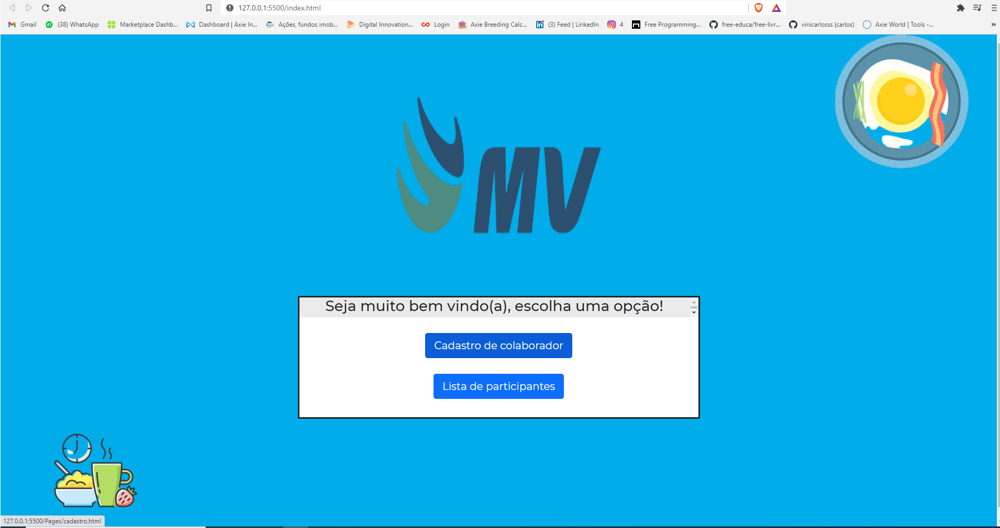
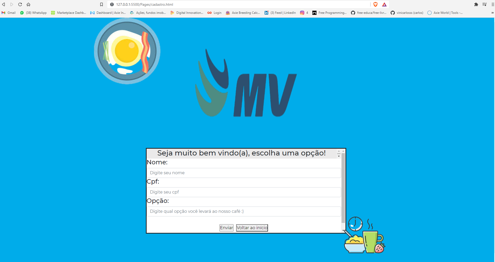

# Desafio_MV
Projeto consiste em uma aplicação web, feita com as ferramentas de desenvolvimento web tradicionais e o backend em node.js. O projeto deve pedir o informações do colaborador e informações sobre um café da manhã feito na empresa, após isso os dados devem ser encaminhados para o banco de dados. O projeto servirá como processo seletivo para a vaga pessoa desenvolvedora full stack - projeto cubo MV.
Algumas imagens do projeto a seguir: 

